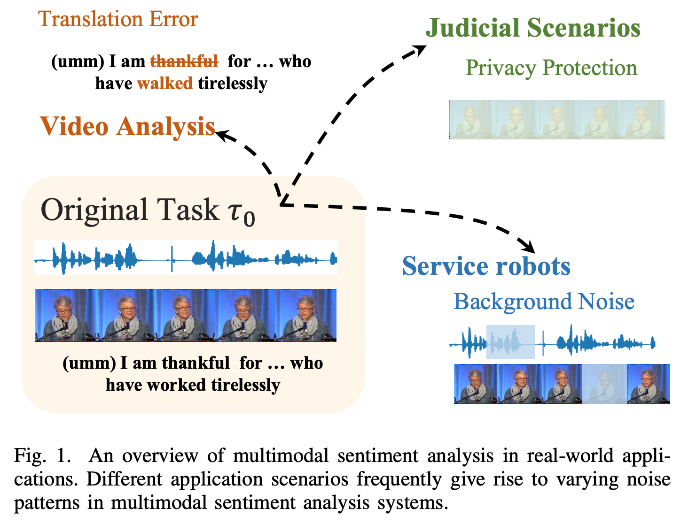
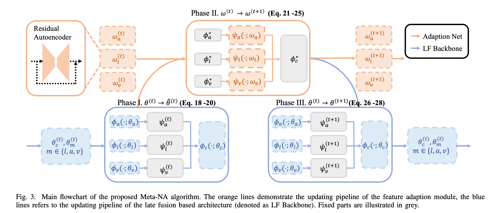

[](#License) [](https://thuiar.github.io/)

# Meta-NA

> Pytorch implementation for codes in [Meta Noise Adaption Framework for Multimodal Sentiment Analysis with Feature Noise (Accepted by IEEE Transactions on Multimedia)](https://ieeexplore.ieee.org/abstract/document/10423206). For baseline methods, please see our repo [MMSA](https://github.com/thuiar/MMSA) and repo  [OpenVNA](https://github.com/Columbine21/OpenVNA) for more details, which are scalable frameworks for MSA and Robust MSA.

## Motivation

> Previous works on robust MSA can be segmented into two classes, one solution is to train individual models from scratch for each type of noise, the other solution is to build unified model for varying noise patterns. As a compromise between training from scratch and utilizing the unified model for an unseen noise pattern, the meta learning paradigm first acquires shared knowledge for all potential types of feature noise during the meta training period, and further refines using instances with the target noise pattern during the meta testing period.

<div align="center">

</div>

## Methodology - Meta-NA

> This work presents the earliest efforts utilizing the meta learning perspective which regard each specific noisy scenario an individual task for feature noise in both training and testing instances. The Meta Noise Adaption strategy is designed to learn prior knowledges of how to deal with noise instance from experiences, enabling fast adaptation for potential applications with unknown noise patterns. Furthermore, the proposed meta-learning perspective and Meta-NA framework can be seamlessly extended to other multimodal tasks and considered a general approach to enhancing the robustness of multimedia applications.



## Usage

1. Dataset Download.
    a. For MOSI dataset, you need to download them Using the following link. (unaligned_50.pkl).

        - [BaiduYun Disk](https://pan.baidu.com/s/1XmobKHUqnXciAm7hfnj2gg) `code: mfet`
        - [Google Drive](https://drive.google.com/drive/folders/1A2S4pqCHryGmiqnNSPLv7rEg63WvjCSk?usp=sharing)

    b. For CH-SIMS v2 dataset, you need to download them Using the following link. (unaligned_50.pkl).

    1. CH-SIMS v2(s) - Supervised data:
      - [Google Drive](https://drive.google.com/drive/folders/1wFvGS0ebKRvT3q6Xolot-sDtCNfz7HRA?usp=sharing)
      - [Baiduyun Drive](https://pan.baidu.com/s/13Ds2_XDIGUqMHt4lXNLQSQ) Code: icmi
    
    b. And move them into the src/data dir, and rename them using `<dataset>_unaligned.pkl` format. e.g. `mosi_unaligned.pkl`.
    
2. Model Reproduce. 

    For reproduce experiments in our paper, Please run the .sh file in src/ dir.

    ```sh
    cd src && sh train_<dataset_name>.sh
    ```
